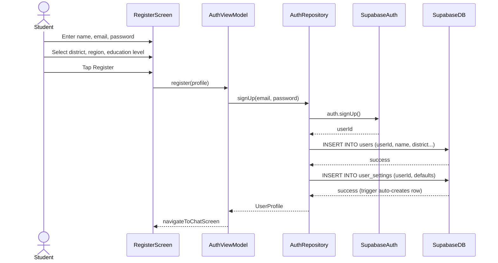
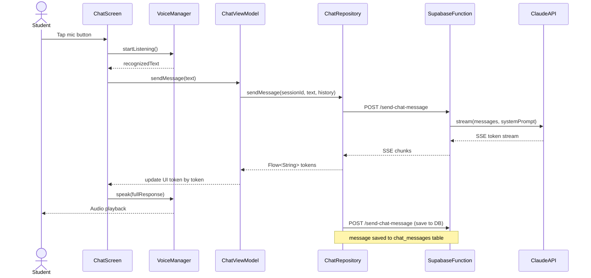
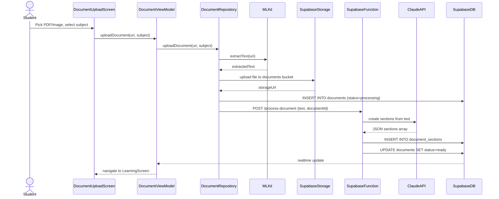
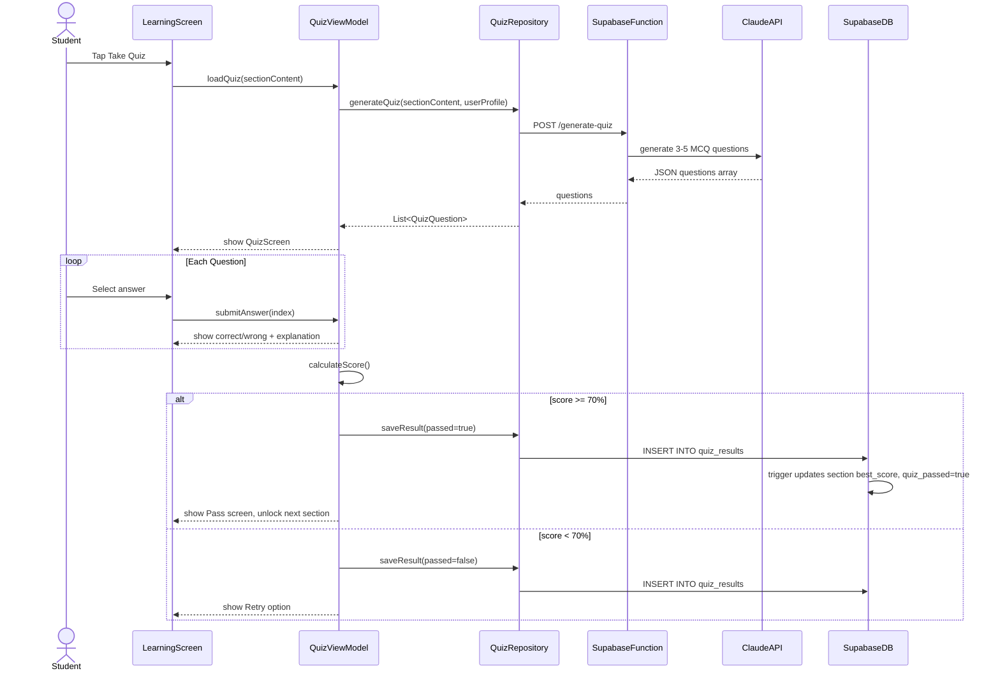
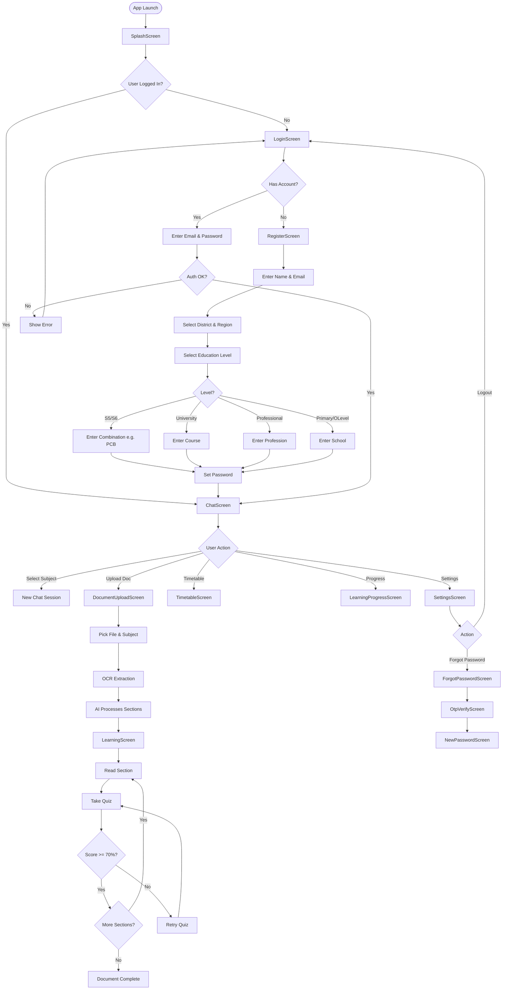
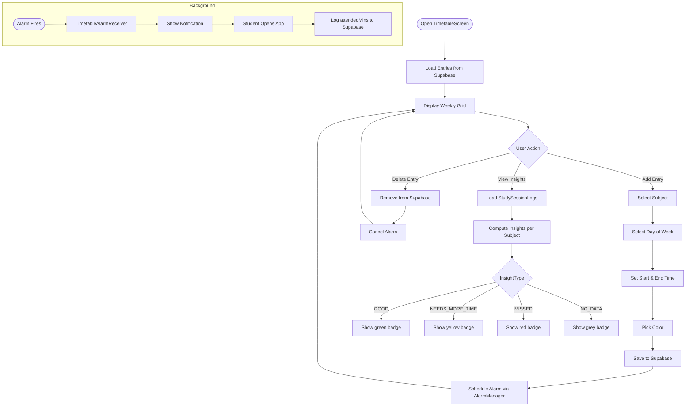
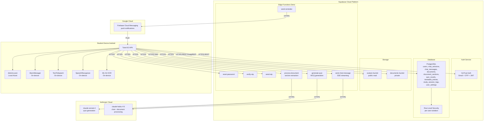

# TutorUG — UML Diagrams

---

## 1. USE CASE DIAGRAM

```mermaid
graph TD
    subgraph Actors
        S((Student))
        T((Teacher\nPhase 3))
        SYS((System\nSupabase +\nClaude AI))
    end

    subgraph Authentication
        UC1[Register Account]
        UC2[Login]
        UC3[Forgot Password / OTP]
        UC4[Change Password]
    end

    subgraph Profile & Settings
        UC5[Select District & Region]
        UC6[Select Education Level]
        UC7[Set School / Combination / Course]
        UC8[Update Avatar]
        UC9[Configure Voice Settings]
        UC10[Set App Theme]
        UC11[Set Study Reminders]
    end

    subgraph AI Tutoring
        UC12[Start Chat Session]
        UC13[Send Text Message]
        UC14[Use Voice Input]
        UC15[Listen to Voice Output]
        UC16[Select Subject]
        UC17[View Chat History]
    end

    subgraph Document Learning
        UC18[Upload PDF / Image]
        UC19[OCR Text Extraction]
        UC20[View Document Sections]
        UC21[Study Section Content]
        UC22[Track Section Progress]
    end

    subgraph Quiz Engine
        UC23[Take Adaptive Quiz]
        UC24[Submit Answers]
        UC25[View Score & Explanations]
        UC26[Retry Failed Quiz]
        UC27[View Quiz History]
    end

    subgraph Timetable
        UC28[Create Study Schedule]
        UC29[Set Alarm Reminders]
        UC30[Log Study Session]
        UC31[View Study Insights]
    end

    subgraph Progress
        UC32[View Learning Dashboard]
        UC33[Track Streak Days]
        UC34[View Document Scores]
    end

    S --> UC1
    S --> UC2
    S --> UC3
    S --> UC4
    S --> UC5
    S --> UC6
    S --> UC7
    S --> UC8
    S --> UC9
    S --> UC10
    S --> UC11
    S --> UC12
    S --> UC13
    S --> UC14
    S --> UC15
    S --> UC16
    S --> UC17
    S --> UC18
    S --> UC20
    S --> UC21
    S --> UC23
    S --> UC24
    S --> UC25
    S --> UC26
    S --> UC27
    S --> UC28
    S --> UC29
    S --> UC30
    S --> UC31
    S --> UC32
    S --> UC33
    S --> UC34

    SYS --> UC19
    SYS --> UC14
    SYS --> UC15

    T --> UC32
    T --> UC27
```

---

## 2. CLASS DIAGRAM

```mermaid
classDiagram

    class UserProfile {
        +String userId
        +String name
        +String email
        +String district
        +String region
        +String educationLevel
        +String school
        +String combination
        +String course
        +String profession
        +String avatarUrl
        +Int totalMessages
        +Int totalQuizzes
        +Int totalDocuments
        +Int streakDays
        +String lastStreakDate
        +String createdAt
        +String lastActive
    }

    class UserSettings {
        +String userId
        +Boolean voiceEnabled
        +Boolean autoReadEnabled
        +Boolean quizSoundEnabled
        +Boolean notificationsEnabled
        +Boolean studyRemindersEnabled
        +String quizDifficulty
        +String appTheme
        +String language
        +String updatedAt
    }

    class ChatSession {
        +String sessionId
        +String userId
        +String subject
        +String educationLevel
        +String title
        +Int messageCount
        +String startedAt
        +String lastMessageAt
        +String documentId
        +Int sectionIndex
    }

    class ChatMessage {
        +String messageId
        +String sessionId
        +String userId
        +String role
        +String content
        +Int tokenCount
        +String createdAt
    }

    class UploadedDocument {
        +String documentId
        +String userId
        +String fileName
        +String storageUrl
        +String mimeType
        +Int fileSizeKb
        +String subject
        +String educationLevel
        +String status
        +Int overallScore
        +Int sectionCount
        +String uploadedAt
        +String processedAt
    }

    class DocumentSection {
        +String sectionId
        +String documentId
        +String userId
        +Int sectionIndex
        +String title
        +String content
        +Boolean quizPassed
        +Int bestScore
        +Int attemptCount
        +String createdAt
    }

    class QuizResult {
        +String quizId
        +String userId
        +String documentId
        +String sectionId
        +String sectionTitle
        +String subject
        +String educationLevel
        +Int score
        +Int totalQuestions
        +Int correctAnswers
        +Boolean passed
        +String difficulty
        +Int timeTakenSec
        +String takenAt
    }

    class QuizQuestion {
        +String question
        +List~String~ options
        +Int correctIndex
        +String explanation
    }

    class TimetableEntry {
        +String entryId
        +String userId
        +String subject
        +Int dayOfWeek
        +Int startHour
        +Int startMin
        +Int endHour
        +Int endMin
        +String colorHex
        +String createdAt
    }

    class StudySessionLog {
        +String logId
        +String userId
        +String entryId
        +String subject
        +Int dayOfWeek
        +Int scheduledMins
        +Int attendedMins
        +Boolean alarmFired
        +String dateStr
        +String createdAt
    }

    class DistrictData {
        +String name
        +String region
        +List~String~ places
        +List~String~ localNames
        +List~String~ landmarks
        +List~String~ foods
        +List~String~ economy
    }

    class AuthRepository {
        +signIn(email, password)
        +signUp(email, password)
        +signOut()
        +sendOtp(email)
        +verifyOtp(email, token)
        +resetPassword(newPassword)
    }

    class ChatRepository {
        +createSession(userId, subject) ChatSession
        +sendMessage(sessionId, message) Flow
        +getSessionMessages(sessionId) List~ChatMessage~
        +getUserSessions(userId) List~ChatSession~
        +deleteSession(sessionId)
    }

    class DocumentRepository {
        +uploadDocument(uri, subject) UploadedDocument
        +getUserDocuments(userId) List~UploadedDocument~
        +getDocumentSections(documentId) List~DocumentSection~
        +deleteDocument(documentId)
    }

    class QuizRepository {
        +generateQuiz(sectionContent) List~QuizQuestion~
        +saveResult(result) QuizResult
        +getUserResults(userId) List~QuizResult~
    }

    class TimetableRepository {
        +addEntry(entry) TimetableEntry
        +getEntries(userId) List~TimetableEntry~
        +deleteEntry(entryId)
        +logSession(log) StudySessionLog
        +getInsights(userId) List~StudyInsight~
    }

    class AuthViewModel {
        +uiState: StateFlow
        +login(email, password)
        +register(profile)
        +logout()
        +sendOtp(email)
        +verifyOtp(token)
    }

    class ChatViewModel {
        +sessions: StateFlow
        +messages: StateFlow
        +sendMessage(text)
        +startNewSession(subject)
        +loadHistory(sessionId)
        +toggleVoice()
    }

    class DocumentViewModel {
        +documents: StateFlow
        +sections: StateFlow
        +uploadDocument(uri, subject)
        +loadSections(documentId)
        +deleteDocument(id)
    }

    class QuizViewModel {
        +questions: StateFlow
        +currentIndex: StateFlow
        +score: StateFlow
        +loadQuiz(sectionContent)
        +submitAnswer(index)
        +finishQuiz()
    }

    class SettingsViewModel {
        +settings: StateFlow
        +updateVoice(enabled)
        +updateTheme(theme)
        +updateDifficulty(level)
        +saveSettings()
    }

    class TimetableViewModel {
        +entries: StateFlow
        +insights: StateFlow
        +addEntry(entry)
        +deleteEntry(id)
        +loadInsights()
    }

    class VoiceManager {
        +startListening()
        +stopListening()
        +speak(text)
        +stopSpeaking()
    }

    UserProfile "1" --> "1" UserSettings
    UserProfile "1" --> "*" ChatSession
    UserProfile "1" --> "*" UploadedDocument
    UserProfile "1" --> "*" QuizResult
    UserProfile "1" --> "*" TimetableEntry
    UserProfile "1" --> "*" StudySessionLog
    ChatSession "1" --> "*" ChatMessage
    UploadedDocument "1" --> "*" DocumentSection
    DocumentSection "1" --> "*" QuizResult
    QuizResult "*" --> "*" QuizQuestion

    AuthViewModel --> AuthRepository
    ChatViewModel --> ChatRepository
    DocumentViewModel --> DocumentRepository
    QuizViewModel --> QuizRepository
    SettingsViewModel --> AuthRepository
    TimetableViewModel --> TimetableRepository

    ChatViewModel --> VoiceManager
```

---

## 3. SEQUENCE DIAGRAMS

### 3a. User Registration

---

### 3b. AI Chat with Voice

---

### 3c. Document Upload & Processing

---

### 3d. Adaptive Quiz Flow

---

## 4. ACTIVITY DIAGRAMS

### 4a. Full App Navigation Flow

---

### 4b. Timetable & Study Reminder Flow

---

## 5. COMPONENT DIAGRAM

```mermaid
graph TD
    subgraph Android App
        subgraph UI Layer
            S1[SplashScreen]
            S2[LoginScreen]
            S3[RegisterScreen]
            S4[ChatScreen]
            S5[DocumentUploadScreen]
            S6[LearningScreen]
            S7[QuizScreen]
            S8[TimetableScreen]
            S9[LearningProgressScreen]
            S10[SettingsScreen]
        end

        subgraph ViewModel Layer
            VM1[AuthViewModel]
            VM2[ChatViewModel]
            VM3[DocumentViewModel]
            VM4[QuizViewModel]
            VM5[TimetableViewModel]
            VM6[SettingsViewModel]
        end

        subgraph Repository Layer
            R1[AuthRepository]
            R2[ChatRepository]
            R3[DocumentRepository]
            R4[QuizRepository]
            R5[TimetableRepository]
            R6[StudySessionRepository]
        end

        subgraph Utilities
            U1[VoiceManager\nSpeechRecognizer + TTS]
            U2[AnthropicClient\nSSE streaming]
            U3[DistrictDatabase\nJSON local]
            U4[AlarmManager\nTimetableAlarmReceiver]
            U5[BootReceiver\nrestore alarms]
            U6[TutorUGMessagingService\nFCM push]
        end

        subgraph Data Layer
            D1[SupabaseClient\nPostgREST + Auth]
            D2[Models.kt\ndata classes]
        end
    end

    subgraph Supabase Cloud
        SB1[Supabase Auth\nJWT + OTP]
        SB2[Supabase DB\nPostgreSQL + RLS]
        SB3[Supabase Storage\ndocuments + avatars]
        subgraph Edge Functions
            EF1[send-chat-message]
            EF2[generate-quiz]
            EF3[process-document]
            EF4[send-otp]
            EF5[verify-otp]
            EF6[reset-password]
            EF7[send-reminder]
        end
    end

    subgraph External APIs
        EX1[Anthropic Claude API\nclaude-haiku / sonnet]
        EX2[Google ML Kit\nOCR text extraction]
        EX3[Android SpeechRecognizer\nvoice input]
        EX4[Android TTS\nvoice output]
    end

    S2 & S3 --> VM1
    S4 --> VM2
    S5 --> VM3
    S6 & S7 --> VM4
    S8 --> VM5
    S10 --> VM6

    VM1 --> R1
    VM2 --> R2
    VM3 --> R3
    VM4 --> R4
    VM5 --> R5
    VM6 --> R1

    VM2 --> U1
    VM2 --> U2

    R1 --> D1
    R2 --> D1
    R3 --> D1
    R4 --> D1
    R5 --> D1
    R6 --> D1

    D1 --> SB1
    D1 --> SB2
    D1 --> SB3

    R2 --> EF1
    R4 --> EF2
    R3 --> EF3
    R1 --> EF4
    R1 --> EF5
    R1 --> EF6

    EF1 --> EX1
    EF2 --> EX1
    EF3 --> EX1

    R3 --> EX2
    U1 --> EX3
    U1 --> EX4

    U4 --> SB2
    U6 --> SB2
```

---

## 6. DEPLOYMENT DIAGRAM

